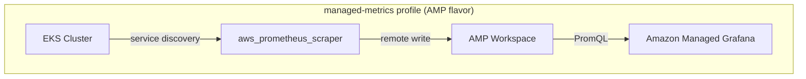
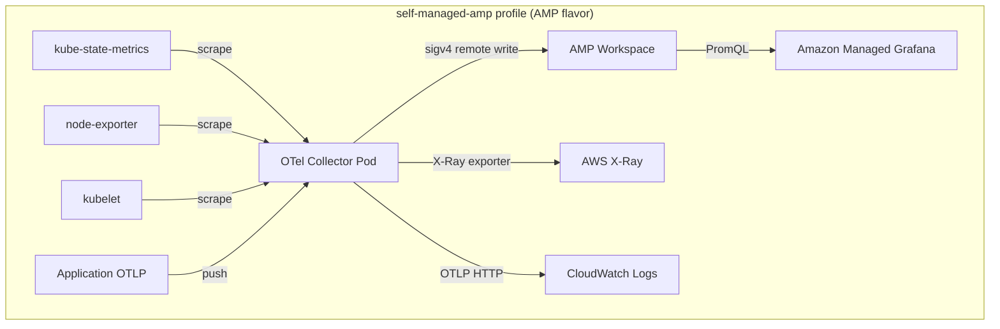
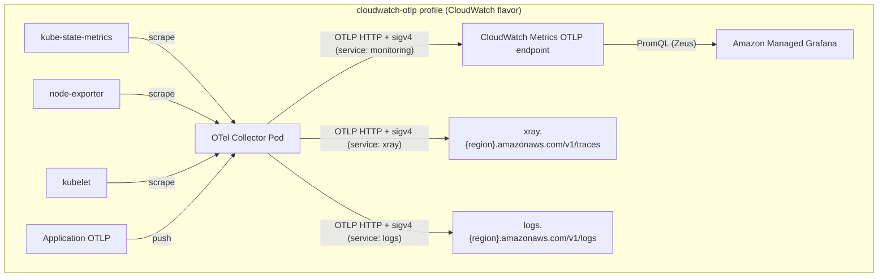

# Design Document: v2 Collector Architecture

## Overview

The v2 Collector Architecture (`modules/eks-monitoring/`, released as `v3.0.0`) replaces the current module with a modular, profile-driven observability stack for EKS clusters. The v1 module suffers from tight coupling to deprecated EKS Blueprints v4, a single ADOT collector path, FluxCD + Grafana Operator for dashboard delivery, and 60+ variables.

The v2 design provides two distinct observability flavors:

1. **AMP flavor** — metrics in Amazon Managed Prometheus, queried via PromQL in Grafana. Profiles: `managed-metrics` (agentless `aws_prometheus_scraper`) and `self-managed-amp` (OTel Collector → AMP remote write).
2. **CloudWatch flavor** — all telemetry via OTLP to CloudWatch. Profile: `cloudwatch-otlp`. Metrics go to the CloudWatch OTLP metrics endpoint (Zeus) with SigV4 service `monitoring`, queried via PromQL in Grafana. Traces to CloudWatch OTLP traces endpoint. Logs to CloudWatch OTLP logs endpoint.

Key design decisions:
- **Profile-driven architecture**: A single `collector_profile` variable selects the deployment mode, and conditional resource creation (`count`) gates all downstream resources. This replaces the v1 approach of 20+ boolean toggles.
- **No EKS Blueprints v4**: All Helm deployments use `helm_release` directly. IRSA uses `terraform-aws-modules/iam/aws` (same pattern as `modules/eks-container-insights/`). No `addon_context` data structure.
- **No FluxCD/Grafana Operator**: Dashboards are provisioned via the `grafana_dashboard` Terraform resource from the Grafana provider, fetching JSON from configurable URLs.
- **Scrape config generation in HCL**: A `locals` block renders Prometheus scrape YAML from structured inputs and base64-encodes it for `aws_prometheus_scraper`.
- **CloudWatch PromQL via Zeus**: The `cloudwatch-otlp` profile configures Grafana with a Prometheus datasource pointing at the CloudWatch PromQL endpoint, enabling the same dashboard experience as the AMP flavor.

## Architecture

### High-Level Module Structure

```
modules/eks-monitoring/
├── main.tf              # Profile routing, AMP workspace, data sources
├── variables.tf         # ≤20 variables for managed-metrics profile
├── outputs.tf           # Backward-compatible outputs
├── versions.tf          # Provider version constraints
├── locals.tf            # Scrape config rendering, computed values
├── collector-managed.tf # aws_prometheus_scraper (managed-metrics)
├── collector-otel.tf    # helm_release for OTel Collector (self-managed-amp, cloudwatch-otlp)
├── iam.tf               # IRSA roles via terraform-aws-modules/iam/aws
├── dashboards.tf        # grafana_dashboard resources
├── rules.tf             # aws_prometheus_rule_group_namespace (recording rules)
├── alerts.tf            # aws_prometheus_rule_group_namespace (alerting rules)
└── helm-support.tf      # kube-state-metrics, node-exporter helm_release
```

### Profile Routing

All resource creation is gated by the `collector_profile` variable using `count` expressions:

```hcl
locals {
  is_managed_metrics  = var.collector_profile == "managed-metrics"
  is_self_managed_amp = var.collector_profile == "self-managed-amp"
  is_cloudwatch_otlp  = var.collector_profile == "cloudwatch-otlp"
  needs_otel_helm     = local.is_self_managed_amp || local.is_cloudwatch_otlp
  needs_irsa          = local.needs_otel_helm
  is_amp_flavor       = local.is_managed_metrics || local.is_self_managed_amp
  is_cw_flavor        = local.is_cloudwatch_otlp
}
```

### Data Flow Diagrams

#### AMP Flavor





#### CloudWatch Flavor



## Components and Interfaces

### 1. Profile Selection & Validation (`main.tf`)

The `collector_profile` variable uses Terraform's `validation` block:

```hcl
variable "collector_profile" {
  type        = string
  description = "Collector deployment profile: managed-metrics (AMP, agentless), self-managed-amp (AMP, OTel Collector), cloudwatch-otlp (CloudWatch, OTel Collector)"
  validation {
    condition     = contains(["managed-metrics", "self-managed-amp", "cloudwatch-otlp"], var.collector_profile)
    error_message = "collector_profile must be one of: managed-metrics, self-managed-amp, cloudwatch-otlp"
  }
}
```

### 2. AMP Managed Collector (`collector-managed.tf`)

Provisions `aws_prometheus_scraper` when `managed-metrics` is selected:

```hcl
resource "aws_prometheus_scraper" "this" {
  count = local.is_managed_metrics ? 1 : 0

  alias = "${var.eks_cluster_id}-scraper"

  source {
    eks {
      cluster_arn       = data.aws_eks_cluster.this.arn
      security_group_ids = var.scraper_security_group_ids
      subnet_ids         = var.scraper_subnet_ids
    }
  }

  destination {
    amp {
      workspace_arn = local.amp_workspace_arn
    }
  }

  scrape_configuration = local.scrape_configuration_base64
  tags                 = var.tags
}
```

Subnet validation enforces the 2-AZ minimum:

```hcl
variable "scraper_subnet_ids" {
  type        = list(string)
  default     = []
  validation {
    condition     = length(var.scraper_subnet_ids) == 0 || length(var.scraper_subnet_ids) >= 2
    error_message = "scraper_subnet_ids must contain at least 2 subnets in 2 distinct Availability Zones"
  }
}
```

No Helm charts are deployed for this profile — `local.needs_otel_helm` is `false`.

### 3. OTel Collector Deployment (`collector-otel.tf`)

Deploys the upstream OpenTelemetry Collector via `helm_release` for `self-managed-amp` and `cloudwatch-otlp` profiles:

```hcl
resource "helm_release" "otel_collector" {
  count = local.needs_otel_helm ? 1 : 0

  name       = "otel-collector"
  repository = "https://open-telemetry.github.io/opentelemetry-helm-charts"
  chart      = "opentelemetry-collector"
  version    = var.otel_collector_chart_version
  namespace  = var.collector_namespace
  create_namespace = true

  values = [local.otel_collector_values]

  dynamic "set" {
    for_each = var.helm_values
    content {
      name  = set.key
      value = set.value
    }
  }
}
```

The `local.otel_collector_values` is computed in `locals.tf` based on the active profile, assembling the correct receivers, processors, exporters, and pipelines.

For `self-managed-amp` (AMP flavor):
- Receivers: `prometheus` (scrape config), `otlp` (traces + logs)
- Exporters: `prometheusremotewrite` (AMP + sigv4 service `aps`), `otlphttp/xray` (X-Ray), `otlphttp/cwlogs` (CloudWatch Logs)
- Extensions: `sigv4auth/aps`, `sigv4auth/xray`

For `cloudwatch-otlp` (CloudWatch flavor):
- Receivers: `prometheus` (scrape config for infra metrics), `otlp` (app metrics + traces + logs)
- Exporters:
  - `otlphttp/metrics` → CloudWatch OTLP metrics endpoint, sigv4 service `monitoring`
  - `otlphttp/traces` → `https://xray.{region}.amazonaws.com/v1/traces`, sigv4 service `xray`
  - `otlphttp/logs` → `https://logs.{region}.amazonaws.com/v1/logs`, sigv4 service `logs`
- Extensions: `sigv4auth/monitoring`, `sigv4auth/xray`, `sigv4auth/logs`

Example OTel Collector config for `cloudwatch-otlp` profile:

```yaml
extensions:
  sigv4auth/monitoring:
    service: "monitoring"
    region: "${region}"
  sigv4auth/xray:
    service: "xray"
    region: "${region}"
  sigv4auth/logs:
    service: "logs"
    region: "${region}"

receivers:
  prometheus:
    config:
      scrape_configs: ${scrape_configs}
  otlp:
    protocols:
      grpc:
        endpoint: "0.0.0.0:4317"
      http:
        endpoint: "0.0.0.0:4318"

processors:
  batch:

exporters:
  otlphttp/metrics:
    endpoint: "${cloudwatch_metrics_endpoint}"
    auth:
      authenticator: sigv4auth/monitoring
  otlphttp/traces:
    endpoint: "https://xray.${region}.amazonaws.com/v1/traces"
    auth:
      authenticator: sigv4auth/xray
  otlphttp/logs:
    endpoint: "https://logs.${region}.amazonaws.com/v1/logs"
    auth:
      authenticator: sigv4auth/logs
    headers:
      x-aws-log-group: "${log_group}"
      x-aws-log-stream: "${log_stream}"

service:
  extensions: [sigv4auth/monitoring, sigv4auth/xray, sigv4auth/logs]
  pipelines:
    metrics:
      receivers: [prometheus, otlp]
      processors: [batch]
      exporters: [otlphttp/metrics]
    traces:
      receivers: [otlp]
      processors: [batch]
      exporters: [otlphttp/traces]
    logs:
      receivers: [otlp]
      processors: [batch]
      exporters: [otlphttp/logs]
```

### 4. IRSA (`iam.tf`)

Uses `terraform-aws-modules/iam/aws` following the pattern from `modules/eks-container-insights/`:

```hcl
module "collector_irsa_role" {
  count   = local.needs_irsa ? 1 : 0
  source  = "terraform-aws-modules/iam/aws//modules/iam-role-for-service-accounts-eks"
  version = "~> 5.33"

  role_name = "${var.eks_cluster_id}-otel-collector"

  attach_amazon_prometheus_remote_write_policy = local.is_self_managed_amp

  oidc_providers = {
    ex = {
      provider_arn               = local.eks_oidc_provider_arn
      namespace_service_accounts = ["${var.collector_namespace}:otel-collector"]
    }
  }

  role_policy_arns = compact([
    # AMP flavor: X-Ray write for traces
    local.is_self_managed_amp ? "arn:${data.aws_partition.current.partition}:iam::aws:policy/AWSXrayWriteOnlyAccess" : "",
    # CloudWatch flavor: PutMetricData for metrics via Zeus OTLP endpoint
    local.is_cloudwatch_otlp ? aws_iam_policy.cloudwatch_put_metric[0].arn : "",
    # CloudWatch flavor: logs and traces
    local.is_cloudwatch_otlp ? "arn:${data.aws_partition.current.partition}:iam::aws:policy/CloudWatchLogsFullAccess" : "",
    local.is_cloudwatch_otlp ? "arn:${data.aws_partition.current.partition}:iam::aws:policy/AWSXrayWriteOnlyAccess" : "",
  ])

  tags = var.tags
}

# Custom policy for cloudwatch:PutMetricData without namespace condition key
resource "aws_iam_policy" "cloudwatch_put_metric" {
  count       = local.is_cloudwatch_otlp ? 1 : 0
  name_prefix = "${var.eks_cluster_id}-cw-put-metric"
  policy = jsonencode({
    Version = "2012-10-17"
    Statement = [{
      Effect   = "Allow"
      Action   = ["cloudwatch:PutMetricData"]
      Resource = "*"
    }]
  })
  tags = var.tags
}
```

### 5. Dashboard Provisioning (`dashboards.tf`)

Replaces FluxCD + Grafana Operator with direct `grafana_dashboard` resources:

```hcl
data "http" "dashboard_json" {
  for_each = var.enable_dashboards ? local.dashboard_sources : {}
  url      = each.value
}

resource "grafana_dashboard" "this" {
  for_each = var.enable_dashboards ? local.dashboard_sources : {}

  config_json = data.http.dashboard_json[each.key].response_body
  folder      = var.grafana_folder_id
  overwrite   = true
}
```

Default dashboard sources are defined in `locals.tf` with a configurable Git tag:

```hcl
locals {
  default_dashboard_sources = {
    cluster             = "https://raw.githubusercontent.com/aws-observability/aws-observability-accelerator/${var.dashboard_git_tag}/artifacts/grafana-dashboards/eks/infrastructure/cluster.json"
    kubelet             = "https://raw.githubusercontent.com/aws-observability/aws-observability-accelerator/${var.dashboard_git_tag}/artifacts/grafana-dashboards/eks/infrastructure/kubelet.json"
    namespace-workloads = "https://raw.githubusercontent.com/aws-observability/aws-observability-accelerator/${var.dashboard_git_tag}/artifacts/grafana-dashboards/eks/infrastructure/namespace-workloads.json"
    node-exporter       = "https://raw.githubusercontent.com/aws-observability/aws-observability-accelerator/${var.dashboard_git_tag}/artifacts/grafana-dashboards/eks/infrastructure/nodeexporter-nodes.json"
    nodes               = "https://raw.githubusercontent.com/aws-observability/aws-observability-accelerator/${var.dashboard_git_tag}/artifacts/grafana-dashboards/eks/infrastructure/nodes.json"
    workloads           = "https://raw.githubusercontent.com/aws-observability/aws-observability-accelerator/${var.dashboard_git_tag}/artifacts/grafana-dashboards/eks/infrastructure/workloads.json"
  }
  dashboard_sources = length(var.dashboard_sources) > 0 ? var.dashboard_sources : local.default_dashboard_sources
}
```

When the Grafana provider is not configured, users set `enable_dashboards = false` to skip provisioning entirely — no error is raised.

### 5a. Grafana Datasource for CloudWatch PromQL (`dashboards.tf`)

For the `cloudwatch-otlp` profile, the module optionally provisions a Grafana Prometheus datasource pointing at the CloudWatch PromQL endpoint (Zeus):

```hcl
resource "grafana_data_source" "cloudwatch_promql" {
  count = local.is_cloudwatch_otlp && var.enable_dashboards ? 1 : 0

  type = "prometheus"
  name = var.grafana_cw_datasource_name
  url  = var.cloudwatch_metrics_endpoint

  json_data_encoded = jsonencode({
    httpMethod   = "POST"
    sigV4Auth    = true
    sigV4Region  = local.region
    sigV4Service = "monitoring"
  })
}
```

This output is also exposed for users who prefer to configure the datasource themselves:

```hcl
output "cloudwatch_promql_datasource_config" {
  description = "Configuration for Grafana Prometheus datasource pointing at CloudWatch PromQL endpoint"
  value = local.is_cloudwatch_otlp ? {
    endpoint     = var.cloudwatch_metrics_endpoint
    sigv4_region  = local.region
    sigv4_service = "monitoring"
    type          = "prometheus"
    http_method   = "POST"
  } : null
}
```

### 6. Scrape Configuration Renderer (`locals.tf`)

Generates Prometheus scrape YAML from structured inputs:

```hcl
locals {
  default_scrape_jobs = [
    {
      job_name        = "kube-state-metrics"
      scrape_interval = var.prometheus_config.global_scrape_interval
      scrape_timeout  = var.prometheus_config.global_scrape_timeout
      static_configs  = [{ targets = ["kube-state-metrics.kube-system.svc.cluster.local:8080"] }]
    },
    {
      job_name        = "node-exporter"
      scrape_interval = var.prometheus_config.global_scrape_interval
      scrape_timeout  = var.prometheus_config.global_scrape_timeout
      static_configs  = [{ targets = ["prometheus-node-exporter.prometheus-node-exporter.svc.cluster.local:9100"] }]
    },
    # kubelet job uses kubernetes_sd_configs
  ]

  all_scrape_jobs = concat(local.default_scrape_jobs, var.additional_scrape_jobs)

  scrape_configuration_yaml = var.scrape_configuration != "" ? var.scrape_configuration : yamlencode({
    global = {
      scrape_interval = var.prometheus_config.global_scrape_interval
      scrape_timeout  = var.prometheus_config.global_scrape_timeout
    }
    scrape_configs = local.all_scrape_jobs
  })

  scrape_configuration_base64 = base64encode(local.scrape_configuration_yaml)
}
```

### 7. Helm Support Charts (`helm-support.tf`)

kube-state-metrics and node-exporter are deployed via `helm_release` for profiles that need in-cluster exporters:

```hcl
resource "helm_release" "kube_state_metrics" {
  count = local.is_managed_metrics || local.is_self_managed_amp || local.is_cloudwatch_otlp ? 1 : 0
  # ... standard helm_release config
}

resource "helm_release" "prometheus_node_exporter" {
  count = local.is_managed_metrics || local.is_self_managed_amp || local.is_cloudwatch_otlp ? 1 : 0
  # ... standard helm_release config
}
```

Note: All profiles need kube-state-metrics and node-exporter. The `managed-metrics` profile needs them for the AMP scraper to discover. The `self-managed-amp` and `cloudwatch-otlp` profiles need them for the OTel Collector's Prometheus receiver to scrape.

### 8. AMP Workspace Management (`main.tf`)

```hcl
resource "aws_prometheus_workspace" "this" {
  count = var.create_amp_workspace ? 1 : 0
  alias = var.amp_workspace_alias
  tags  = var.tags
}

locals {
  amp_workspace_id  = var.create_amp_workspace ? aws_prometheus_workspace.this[0].id : var.managed_prometheus_workspace_id
  amp_workspace_arn = var.create_amp_workspace ? aws_prometheus_workspace.this[0].arn : data.aws_prometheus_workspace.existing[0].arn
  amp_workspace_endpoint = "https://aps-workspaces.${local.region}.amazonaws.com/workspaces/${local.amp_workspace_id}/"
}
```

### 9. Alerting & Recording Rules (`alerts.tf`, `rules.tf`)

Same `aws_prometheus_rule_group_namespace` pattern as v1, but gated by booleans and supporting custom rule appending:

```hcl
resource "aws_prometheus_rule_group_namespace" "recording_rules" {
  count        = var.enable_recording_rules ? 1 : 0
  name         = "accelerator-v2-recording-rules"
  workspace_id = local.amp_workspace_id
  data         = local.recording_rules_yaml  # default + custom_recording_rules
}
```

## Data Models

### Variable Surface (managed-metrics profile ≤ 20 variables)

| # | Variable | Type | Required | Default |
|---|----------|------|----------|---------|
| 1 | `collector_profile` | `string` | yes | — |
| 2 | `eks_cluster_id` | `string` | yes | — |
| 3 | `eks_oidc_provider_arn` | `string` | yes | — |
| 4 | `create_amp_workspace` | `bool` | no | `true` |
| 5 | `managed_prometheus_workspace_id` | `string` | no | `null` |
| 6 | `scraper_subnet_ids` | `list(string)` | yes* | — |
| 7 | `scraper_security_group_ids` | `list(string)` | yes* | — |
| 8 | `scrape_configuration` | `string` | no | `""` |
| 9 | `additional_scrape_jobs` | `list(any)` | no | `[]` |
| 10 | `prometheus_config` | `object` | no | `{scrape_interval="60s", scrape_timeout="15s"}` |
| 11 | `enable_dashboards` | `bool` | no | `true` |
| 12 | `dashboard_sources` | `map(string)` | no | `{}` |
| 13 | `dashboard_git_tag` | `string` | no | `"v0.3.2"` |
| 14 | `grafana_folder_id` | `string` | no | `null` |
| 15 | `enable_alerting_rules` | `bool` | no | `true` |
| 16 | `enable_recording_rules` | `bool` | no | `true` |
| 17 | `custom_alerting_rules` | `string` | no | `""` |
| 18 | `custom_recording_rules` | `string` | no | `""` |
| 19 | `amp_workspace_alias` | `string` | no | `"eks-monitoring"` |
| 20 | `tags` | `map(string)` | no | `{}` |

*Required only when `collector_profile = "managed-metrics"`.

### Additional Variables (self-managed-amp / cloudwatch-otlp profiles)

| Variable | Type | Profile |
|----------|------|---------|
| `otel_collector_chart_version` | `string` | self-managed-amp, cloudwatch-otlp |
| `collector_namespace` | `string` | self-managed-amp, cloudwatch-otlp |
| `helm_values` | `map(string)` | self-managed-amp, cloudwatch-otlp |
| `cloudwatch_metrics_endpoint` | `string` | cloudwatch-otlp |
| `cloudwatch_log_group` | `string` | cloudwatch-otlp |
| `cloudwatch_log_stream` | `string` | cloudwatch-otlp |
| `enable_tracing` | `bool` | self-managed-amp |
| `enable_logs` | `bool` | self-managed-amp |

### Outputs

| Output | Description |
|--------|-------------|
| `managed_prometheus_workspace_endpoint` | Full AMP workspace endpoint URL (AMP flavor) |
| `managed_prometheus_workspace_id` | AMP workspace ID (AMP flavor) |
| `managed_prometheus_workspace_region` | AMP workspace region |
| `collector_irsa_arn` | IRSA role ARN (self-managed profiles only) |
| `amp_scraper_arn` | ARN of `aws_prometheus_scraper` (managed-metrics only) |
| `eks_cluster_id` | EKS cluster identifier |
| `cloudwatch_promql_datasource_config` | Object with `endpoint`, `sigv4_region`, `sigv4_service` for Grafana Prometheus datasource (cloudwatch-otlp only) |

### Provider Requirements

```hcl
terraform {
  required_version = ">= 1.5.0"
  required_providers {
    aws = {
      source  = "hashicorp/aws"
      version = ">= 5.0.0"
    }
    helm = {
      source  = "hashicorp/helm"
      version = ">= 2.10.0"
    }
    grafana = {
      source  = "grafana/grafana"
      version = ">= 2.0.0"
      configuration_aliases = [grafana]
    }
  }
}
```

The `kubernetes` and `kubectl` providers are not required by the module itself. The Helm provider handles all in-cluster deployments. The Grafana provider is only needed when `enable_dashboards = true`.


## Correctness Properties

*A property is a characteristic or behavior that should hold true across all valid executions of a system — essentially, a formal statement about what the system should do. Properties serve as the bridge between human-readable specifications and machine-verifiable correctness guarantees.*

### Property 1: Profile validation is exhaustive

*For any* string value assigned to `collector_profile`, the Terraform validation passes if and only if the value is one of `"managed-metrics"`, `"self-managed-amp"`, or `"cloudwatch-otlp"`. All other strings must be rejected with an error message listing the valid profiles.

**Validates: Requirements 1.1, 1.5**

### Property 2: Subnet count validation

*For any* list of subnet IDs with length 1 (and non-zero length less than 2), the `scraper_subnet_ids` validation must fail. For any list with length >= 2 or length == 0, validation must pass.

**Validates: Requirements 2.2, 2.3**

### Property 3: OTLP endpoint URL construction

*For any* valid AWS region string, the generated CloudWatch OTLP traces endpoint must equal `https://xray.{region}.amazonaws.com/v1/traces`, the logs endpoint must equal `https://logs.{region}.amazonaws.com/v1/logs`, and the metrics endpoint must use the configured `cloudwatch_metrics_endpoint` variable with SigV4 service `monitoring`.

**Validates: Requirements 4.1, 4.2, 4.3**

### Property 3a: CloudWatch metrics SigV4 service is `monitoring`

*For any* `cloudwatch-otlp` profile configuration, the `sigv4auth` extension used by the metrics exporter must have `service` set to `"monitoring"`. The traces exporter must use service `"xray"`. The logs exporter must use service `"logs"`.

**Validates: Requirements 4.1, 4.2, 4.3**

### Property 4: CloudWatch log headers contain configured values

*For any* non-empty `cloudwatch_log_group` and `cloudwatch_log_stream` variable values, the generated OTel Collector configuration for the `cloudwatch-otlp` profile must contain `x-aws-log-group` set to the log group value and `x-aws-log-stream` set to the log stream value.

**Validates: Requirements 4.4**

### Property 5: Default dashboard URLs contain the configured git tag

*For any* non-empty `dashboard_git_tag` string, every URL in the default `dashboard_sources` map must contain that exact tag string in its path.

**Validates: Requirements 6.3**

### Property 6: Scrape config renderer merges jobs and applies global settings

*For any* list of additional scrape job objects and any valid `scrape_interval` and `scrape_timeout` values, the rendered scrape configuration YAML must contain all 3 default jobs (kube-state-metrics, node-exporter, kubelet) plus all additional jobs, and the global section must contain the provided interval and timeout values.

**Validates: Requirements 7.2, 7.5**

### Property 7: Scrape configuration base64 round trip

*For any* generated scrape configuration YAML string, base64-decoding the `scrape_configuration_base64` output must produce a string identical to the `scrape_configuration_yaml` output.

**Validates: Requirements 7.3**

### Property 8: Custom scrape configuration overrides defaults

*For any* non-empty `scrape_configuration` input string, the rendered `scrape_configuration_yaml` output must be exactly equal to the provided input, and no default scrape jobs should be present unless they were in the custom input.

**Validates: Requirements 7.4**

### Property 9: AMP workspace endpoint URL format

*For any* valid AMP workspace ID and AWS region, the `managed_prometheus_workspace_endpoint` output must equal `https://aps-workspaces.{region}.amazonaws.com/workspaces/{id}/`, and the `managed_prometheus_workspace_id` and `managed_prometheus_workspace_region` outputs must be non-empty, regardless of whether the workspace was created or referenced.

**Validates: Requirements 8.4, 11.1**

### Property 10: Custom rules are appended to default rules

*For any* non-empty `custom_alerting_rules` or `custom_recording_rules` YAML string, the final rendered rule group data must contain both the default infrastructure rules and the custom rules appended.

**Validates: Requirements 9.3**

## Error Handling

| Scenario | Behavior |
|----------|----------|
| Invalid `collector_profile` value | Terraform `validation` block rejects with message listing valid profiles |
| `scraper_subnet_ids` has fewer than 2 entries (when non-empty) | Terraform `validation` block rejects with descriptive message |
| `create_amp_workspace = false` and `managed_prometheus_workspace_id` not set | Terraform `validation` block (precondition on locals) rejects with message requiring workspace ID |
| Grafana provider not configured + `enable_dashboards = true` | User must set `enable_dashboards = false`; otherwise Terraform provider initialization fails (standard Terraform behavior) |
| `data.http` fetch for dashboard JSON fails | Terraform `data.http` returns error; user can override `dashboard_sources` with local file paths |
| Invalid `scrape_configuration` YAML | `aws_prometheus_scraper` API rejects the configuration at apply time with an API error |
| IRSA role creation fails (missing OIDC provider) | Terraform fails at plan/apply with clear IAM error from the `terraform-aws-modules/iam/aws` module |
| Helm chart deployment fails (cluster unreachable) | `helm_release` resource fails with Helm provider error; standard Terraform retry/re-apply |

## Implementation Streams

The two flavors are independent and can be implemented in parallel streams:

**Stream 1: CloudWatch flavor (cloudwatch-otlp)** — Priority for internal demo ahead of Zeus launch.
- Module skeleton (`main.tf`, `variables.tf`, `versions.tf`, `outputs.tf`, `locals.tf`)
- OTel Collector Helm deployment (`collector-otel.tf`)
- IRSA with `cloudwatch:PutMetricData` + logs + traces policies (`iam.tf`)
- OTel Collector config with `sigv4auth/monitoring`, `sigv4auth/xray`, `sigv4auth/logs`
- kube-state-metrics + node-exporter Helm charts (`helm-support.tf`)
- Grafana datasource for CloudWatch PromQL (`dashboards.tf`)
- Dashboard provisioning (`dashboards.tf`)
- Example: `examples/eks-cloudwatch-otlp/`

**Stream 2: AMP flavor (managed-metrics, self-managed-amp)** — Can follow after CloudWatch demo.
- AMP Managed Collector (`collector-managed.tf`, scrape config renderer)
- Self-managed OTel → AMP remote write path
- AMP workspace management
- Alerting and recording rules (`alerts.tf`, `rules.tf`)
- Examples: `examples/eks-amp-managed/`, `examples/eks-amp-otel/`

**Shared foundation** (needed by both, built first):
- Module skeleton with profile routing
- `versions.tf` with provider constraints
- `variables.tf` core variables
- `outputs.tf` backward-compatible outputs
- `UPGRADING.md` documenting migration from `v2.x` → `v3.0.0`

Consumers reference the module via git tag: `source = "github.com/aws-observability/terraform-aws-observability-accelerator//modules/eks-monitoring?ref=v3.0.0"`

## Testing Strategy

### Unit Tests (Terraform-native)

Use `terraform validate` and `terraform plan` with variable fixtures to verify:
- Profile validation rejects invalid values and accepts valid ones
- Subnet count validation works correctly
- Conditional resource counts match expectations per profile (e.g., `managed-metrics` creates 0 `helm_release.otel_collector`, 1 `aws_prometheus_scraper`)
- AMP workspace precondition triggers when `create_amp_workspace = false` and no workspace ID provided
- Output values are populated for each profile

Use Terratest (Go) or `pytest-terraform` for integration tests that apply the module against a real or mocked AWS environment.

### Property-Based Tests

Use `fast-check` (TypeScript) or `hypothesis` (Python) to test the HCL logic extracted into a testable helper. Since the scrape config rendering and endpoint URL construction are pure functions of their inputs, they can be extracted and tested independently.

Library: `fast-check` (TypeScript) — aligns with the project's existing JS/TS tooling for documentation and CI.

Configuration: minimum 100 iterations per property test.

Each property test must be tagged with a comment referencing the design property:

```typescript
// Feature: v2-collector-architecture, Property 1: Profile validation is exhaustive
fc.assert(fc.property(fc.string(), (input) => {
  const valid = ["managed-metrics", "self-managed-amp", "cloudwatch-otlp"];
  expect(isValidProfile(input)).toBe(valid.includes(input));
}), { numRuns: 100 });
```

Property tests to implement:
1. **Property 1**: Profile validation — generate random strings, verify acceptance iff in valid set
2. **Property 2**: Subnet validation — generate lists of varying lengths, verify validation behavior
3. **Property 3**: OTLP endpoint construction — generate region strings, verify URL format
4. **Property 4**: Log headers — generate log group/stream names, verify presence in config
5. **Property 5**: Dashboard git tag — generate tag strings, verify all URLs contain the tag
6. **Property 6**: Scrape config merging — generate additional job lists + interval/timeout, verify output
7. **Property 7**: Base64 round trip — generate YAML strings, verify decode(encode(x)) == x
8. **Property 8**: Custom config override — generate non-empty strings, verify passthrough
9. **Property 9**: AMP endpoint format — generate workspace IDs + regions, verify URL pattern
10. **Property 10**: Custom rules appending — generate rule YAML, verify concatenation

### Integration Tests

Terratest-based tests that `terraform apply` the module with each profile against a real EKS cluster:
- `managed-metrics`: verify `aws_prometheus_scraper` exists, no OTel pods in cluster
- `self-managed-amp`: verify OTel Collector pods running, IRSA role exists, metrics flowing to AMP
- `cloudwatch-otlp`: verify OTel Collector pods running, metrics visible via CloudWatch PromQL endpoint, traces in X-Ray, logs in CloudWatch Logs
