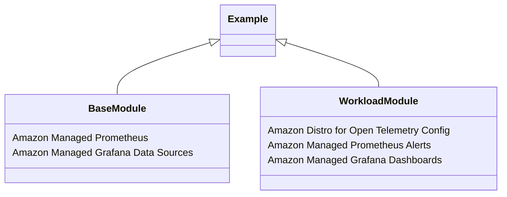

# Concepts

## Prerequisites

All examples in this repository require the following tools installed

1. [Terraform](https://learn.hashicorp.com/tutorials/terraform/install-cli)
2. [AWS CLI](https://docs.aws.amazon.com/cli/latest/userguide/install-cliv2.html)
3. [Kubectl](https://Kubernetes.io/docs/tasks/tools/)

### Minimum IAM Policy

To run the examples, you need a set of AWS IAM permissions. You can find an example of minimum
permissions required [in this file](https://github.com/aws-observability/terraform-aws-observability-accelerator/blob/main/docs/iam/min-iam-policy.json).

!!! warning
    The policy resource is set as `*` to allow all resources, this is not a recommended practice.
    You should restrict instead to the ARNs when applicable.

### Terraform states and variables

By default, our examples are using local Terraform states. If you need
your Terraform states to be saved remotely, on Amazon S3, visit the
[terraform remote states](https://www.terraform.io/language/state/remote) documentation.

For simplicity, we use Terraform supported environment variables.
You can also edit the `terraform.tfvars` files directly and deploy
with `terraform apply -var-file=terraform.tfvars`. Terraform tfvars file can be useful if
you need to track changes as part of a Git repository or CI/CD pipeline.

!!! warning
    When using `tfvars` files, always be careful to not store and commit any secrets (keys,     passwords, ...)

## Grafana contents via GitOps on Amazon Managed Grafana

We have upgraded our solution to use [grafana-operator](https://github.com/grafana-operator/grafana-operator#:~:text=The%20grafana%2Doperator%20is%20a,an%20easy%20and%20scalable%20way.) and [Flux](https://fluxcd.io/) to create Grafana data sources, folder and dashboards via GitOps on Amazon Managed Grafana.

The grafana-operator is a Kubernetes operator built to help you manage your Grafana instances inside and outside Kubernetes. Grafana Operator makes it possible for you to manage and create Grafana dashboards, datasources etc. declaratively between multiple instances in an easy and scalable way. Using grafana-operator it will be possible to add AWS data sources such as Amazon Managed Service for Prometheus, Amazon CloudWatch, AWS X-Ray to Amazon Managed Grafana and create Grafana dashboards on Amazon Managed Grafana from your Amazon EKS cluster. This enables us to use our Kubernetes cluster to create and manage the lifecycle of resources in Amazon Managed Grafana in a Kubernetes native way. This ultimately enables us to use GitOps mechanisms using CNCF projects such as Flux  to create and manage the lifecycle of resources in Amazon Managed Grafana.

GitOps is a way of managing application and infrastructure deployment so that the whole system is described declaratively in a Git repository. It is an operational model that offers you the ability to manage the state of multiple Kubernetes clusters leveraging the best practices of version control, immutable artifacts, and automation. Flux  is a declarative, GitOps-based continuous delivery tool that can be integrated into any CI/CD pipeline. It gives users the flexibility of choosing their Git provider (GitHub, GitLab, BitBucket). Now, with grafana-operator supporting the management of external Grafana instances such as Amazon Managed Grafana, operations personas can use GitOps mechanisms using CNCF projects such as Flux to create and manage the lifecycle of resources in Amazon Managed Grafana.

We have setup a [GitRepository](https://fluxcd.io/flux/components/source/gitrepositories/) and [Kustomization](https://fluxcd.io/flux/components/kustomize/kustomization/) using Flux to sync our GitHub Repository to add Grafana Datasources, folder and Dashboards to Amazon Managed Grafana using Grafana Operator. GitRepository defines a Source to produce an Artifact for a Git repository revision. Kustomization defines a pipeline for fetching, decrypting, building, validating and applying Kustomize overlays or plain Kubernetes manifests. we are also using [Flux Post build variable substitution](https://fluxcd.io/flux/components/kustomize/kustomization/#post-build-variable-substitution) to dynamically render variables such as AMG_AWS_REGION, AMP_ENDPOINT_URL, AMG_ENDPOINT_URL,GRAFANA_NODEEXP_DASH_URL on the YAML manifests during deployment time to avoid hardcoding on the YAML manifests stored in Git repo.

We have placed our declarative code snippet to create an Amazon Managed Service For Promethes datasource and Grafana Dashboard in Amazon Managed Grafana in our [AWS Observabiity Accelerator GitHub Repository](https://github.com/aws-observability/aws-observability-accelerator). We have setup a GitRepository to point to the AWS Observabiity Accelerator GitHub Repository and `Kustomization` for flux to sync Git Repository with artifacts in `./artifacts/grafana-operator-manifests/*` path in the AWS Observabiity Accelerator GitHub Repository. You can use this extension of our solution to point your own Kubernetes manifests to create Grafana Datasources and personified Grafana Dashboards of your choice using GitOps with Grafana Operator and Flux in Kubernetes native way with altering and redeploying this solution for changes to Grafana resources.


## Release notes

We encourage you to use our [release versions](https://github.com/aws-observability/terraform-aws-observability-accelerator/releases)
as much as possible to avoid breaking changes when deploying Terraform modules. You can
read also our change log on the releases page. Here's an example of using a fixed version:

```hcl
module "eks_monitoring" {
    source = "github.com/aws-observability/terraform-aws-observability-accelerator//modules/managed-prometheus-monitoring?ref=v2.5.0"
}
```


## Base module

The base module allows you to configure the AWS Observability services for your cluster and
the AWS Distro for OpenTelemetry (ADOT) Operator as the signals collection mechanism.

This is the minimum configuration to have a new Amazon Managed Service for Prometheus Workspace
and ADOT Operator deployed for you and ready to receive your data.
The base module serve as an anchor to the workload modules and cannot run on its own.

```hcl
module "aws_observability_accelerator" {
  # use release tags and check for the latest versions
  # https://github.com/aws-observability/terraform-aws-observability-accelerator/releases
  source = "github.com/aws-observability/terraform-aws-observability-accelerator?ref=v1.6.1"

  aws_region     = "eu-west-1"
  eks_cluster_id = "my-eks-cluster"

  # As Grafana shares a different lifecycle, we recommend using an existing workspace.
  managed_grafana_workspace_id = var.managed_grafana_workspace_id
}
```

You can optionally reuse an existing Amazon Managed Service for Prometheus Workspace:

```hcl
module "aws_observability_accelerator" {
  # use release tags and check for the latest versions
  # https://github.com/aws-observability/terraform-aws-observability-accelerator/releases
  source = "github.com/aws-observability/terraform-aws-observability-accelerator?ref=v1.6.1"

  aws_region     = "eu-west-1"
  eks_cluster_id = "my-eks-cluster"

  # prevents creation of a new Amazon Managed Prometheus workspace
  enable_managed_prometheus = false

  # reusing existing Amazon Managed Prometheus Workspace
  managed_prometheus_workspace_id  = "ws-abcd123..."

  managed_grafana_workspace_id = "g-abcdef123"
}
```

View all the configuration options in the [module's documentation](https://github.com/aws-observability/terraform-aws-observability-accelerator#requirements)

## Workload modules

Workloads modules are focused Terraform modules provided in this repository. They essentially provide curated metrics collection, alerts and Grafana dashboards according to the use case. Most of those modules require the base module.

You can check the full workload modules list and their documentation [here](https://github.com/aws-observability/terraform-aws-observability-accelerator/tree/main/modules/).

All the modules come with end-to-end deployable examples.

## Examples

[Examples](https://github.com/aws-observability/terraform-aws-observability-accelerator/tree/main/examples) put modules together in a ready to deploy terraform configuration as a starting point. With little to no configuration, you can run `terraform apply` and use the deployed resources on your AWS Account.

You can find **workload** examples like [Amazon EKS infrastructure monitoring](https://aws-observability.github.io/terraform-aws-observability-accelerator/eks/) or [monitoring your Amazon Managed Service for Prometheus workspace](https://aws-observability.github.io/terraform-aws-observability-accelerator/workloads/managed-prometheus/) and more.




## Getting started with AWS Observability services

If you are new to AWS Observability services, or want to dive deeper into them,
check our [One Observability Workshop](https://catalog.workshops.aws/observability/)
for a hands-on experience in a self-paced environment or at an AWS venue.
