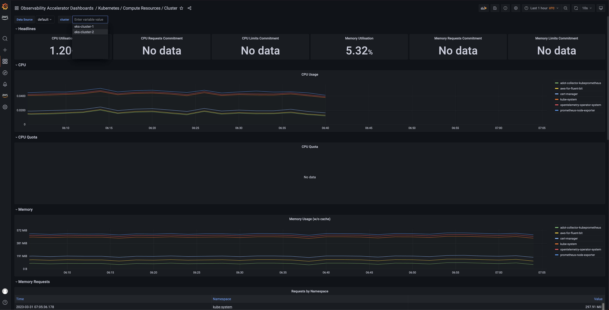
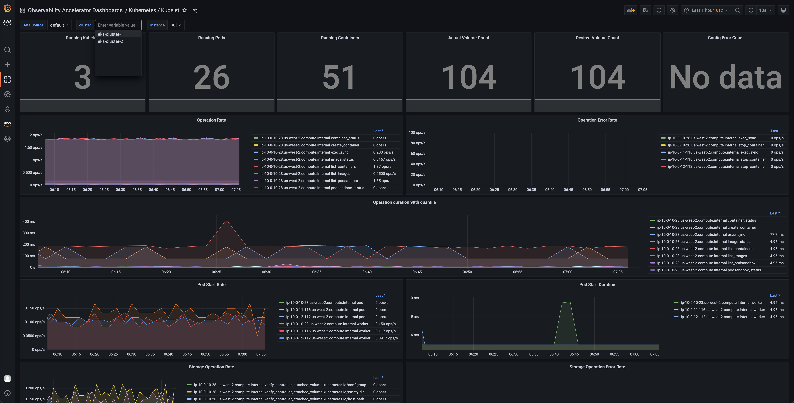

# AWS EKS Multicluster Observability

This example shows how to use the [AWS Observability Accelerator](https://github.com/aws-observability/terraform-aws-observability-accelerator), with more than one EKS cluster and verify the collected metrics from all the clusters in the dashboards of a common `Amazon Managed Grafana` workspace.

## Prerequisites

1. Using the example [eks-cluster-with-vpc](../../examples/eks-cluster-with-vpc/), create two EKS clusters with the names:
   1. `eks-cluster-1`
   2. `eks-cluster-2`
2. Following the instructions found in this [blog post](https://aws.amazon.com/blogs/mt/announcing-aws-observability-accelerator-to-configure-comprehensive-observability-for-amazon-eks/):
   1. Create an `Amazon Managed Grafana` workspace and capture the workspace ID (ex: g-abc123)
   2. Create an Grafana dashboards API key and capture the (contents of the) key

## Setup

#### 1. Download sources and initialize Terraform

```sh
git clone https://github.com/aws-observability/terraform-aws-observability-accelerator.git
cd terraform-aws-observability-accelerator/examples/eks-multicluster
terraform init
```

#### 2. Create Terraform variables file for eks-cluster-1

Create a `terraform` variables file **eks-cluster-1.tfvars**, specific to the first EKS cluster, as shown below. Ensure to substitute the `<AMG Workspace ID>` and `<AMG Key with admin access>` with correct values working with the existing `Amazon Managed Grafana` workspace.

**eks-cluster-1.tfvars**
```
# (mandatory) EKS cluster id/name
eks_cluster_id = "eks-cluster-1"

enable_alertmanager         = true
create_dashboard_folder     = true
enable_dashboards           = true
create_prometheus_data_source  = true

enable_recording_rules      = true
enable_alerting_rules       = true
enable_java_recording_rules = true
enable_java_alerting_rules  = true

# (mandatory) Amazon Managed Grafana Workspace ID: ex: g-abc123
managed_grafana_workspace_id = "<AMG Workspace ID>"

# (optional) Leave it empty for a new workspace to be created
managed_prometheus_workspace_id = ""

# (mandatory) Grafana API Key - https://docs.aws.amazon.com/grafana/latest/userguide/API_key_console.html
grafana_api_key = "<AMG Key with admin access>"
```

#### 3. Deploy Observability for the first EKS cluster

Deploy the Observability for the first EKS cluster and capture the `Amazon Managed Service for Prometheus` workspace ID that was created as a result.

!!! warning
    Run the task to completion before moving to the next step

```sh
terraform apply -var-file=eks-cluster-1.tfvars -state=./eks-cluster-1.tfstate --auto-approve
```

#### 4. Create Terraform variables file for eks-cluster-2

Similar to step #2, create a `terraform` variables file **eks-cluster-2.tfvars**, specific to the second EKS cluster, as shown below. This time around, in addition to `<AMG Workspace ID>` and `<AMG Key with admin access>`, substitute `<ws-XXXX-XXXXX-XXXXX-XXXXXXXXX>` as well with the workspace ID you noted the previous step.

**eks-cluster-2.tfvars**
```
# (mandatory) EKS cluster id/name
eks_cluster_id = "eks-cluster-2"

enable_alertmanager         = false
create_dashboard_folder     = false
enable_dashboards           = false
create_prometheus_data_source  = false

enable_recording_rules      = false
enable_alerting_rules       = false
enable_java_recording_rules = false
enable_java_alerting_rules  = false

# (mandatory) Amazon Managed Grafana Workspace ID: ex: g-abc123
managed_grafana_workspace_id = "<AMG Workspace ID>"

# (optional) Leave it empty for a new workspace to be created
managed_prometheus_workspace_id = "<ws-XXXX-XXXXX-XXXXX-XXXXXXXXX>"

# (mandatory) Grafana API Key - https://docs.aws.amazon.com/grafana/latest/userguide/API_key_console.html
grafana_api_key = "<AMG Key with admin access>"
```

#### 5. Deploy Observability for the second EKS cluster

```sh
terraform apply -var-file=eks-cluster-2.tfvars -state=./eks-cluster-2.tfstate --auto-approve
```

## Verifying Multicluster Observability

One you have successfully run the above setup, you should be able to see dashboards similar to the images shown below in `Amazon Managed Grafana` workspace.

Note how you are able to use the `cluster` dropdown to filter the dashboards to metrics collected from a specific EKS cluster.





## Cleanup

```sh
# Clean up Observability on eks-cluster-1
terraform destroy -var-file=eks-cluster-1.tfvars -state=./eks-cluster-1.tfstate --auto-approve

# Clean up Observability on eks-cluster-2
terraform destroy -var-file=eks-cluster-2.tfvars -state=./eks-cluster-2.tfstate --auto-approve
```
