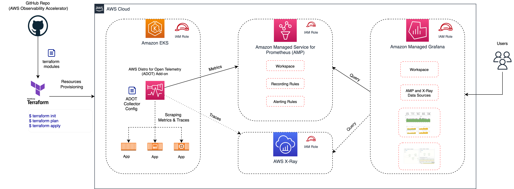

# AWS Observability Accelerator for Terraform

Welcome to the AWS Observability Accelerator for Terraform!

The AWS Observability Accelerator for Terraform is a set of opinionated modules to
help you set up observability for your AWS environments with
AWS-managed observability services such as Amazon Managed Service for Prometheus,
Amazon Managed Grafana, AWS Distro for OpenTelemetry (ADOT) and Amazon CloudWatch.

We provide curated metrics, logs, traces collection, alerting rules and Grafana
dashboards for your EKS infrastructure, Java/JMX, NGINX based workloads and
your custom applications.

You also can monitor your Amazon Managed Service for Prometheus workspaces ingestion,
costs, active series with [this module](https://aws-observability.github.io/terraform-aws-observability-accelerator/workloads/managed-prometheus/).

## Getting started

This project provides a set of Terraform modules to enable metrics, logs and
traces collection, dashboards and alerts for monitoring:

- Amazon EKS clusters infrastructure and applications
- NGINX workloads (running on Amazon EKS)
- Java/JMX workloads (running on Amazon EKS)
- Amazon Managed Service for Prometheus workspaces with Amazon CloudWatch
- Installs Grafana Operator to add AWS data sources and create Grafana Dashboards to Amazon Managed Grafana.
- Installs FluxCD to perform GitOps sync of a Git Repo to EKS Cluster. We will use this later for creating Grafana Dashboards and AWS datasources to Amazon Managed Grafana. 
- Installs External Secrets Operator to retrieve and Sync the Grafana API keys.

These modules can be directly configured in your existing Terraform
configurations or ready to be deployed in our packaged
[examples](https://github.com/aws-observability/terraform-aws-observability-accelerator/tree/main/examples)

!!! tip
    We have supporting examples for quick setup such as:

    - Creating a new Amazon EKS cluster and a VPC
    - Creating and configure an Amazon Managed Grafana workspace with SSO

## Motivation

To gain deep visibility into your workloads and environments, AWS proposes a
set of secure, scalable, highly available, production-grade managed open
source services such as Amazon Managed Service for Prometheus, Amazon Managed
Grafana and Amazon OpenSearch.

AWS customers have asked for best-practices and guidance to collect metrics, logs
and traces from their containerized applications and microservices with ease of
deployment. Customers can use the AWS Observability Accelerator to configure their
metrics and traces collection, leveraging [AWS Distro for OpenTelemetry](https://aws-otel.github.io/),
to have opinionated dashboards and alerts available in only minutes.

## Support & Feedback

AWS Observability Accelerator for Terraform is maintained by AWS Solution Architects.
It is not part of an AWS service and support is provided best-effort by the
AWS Observability Accelerator community.

To post feedback, submit feature ideas, or report bugs, please use the [issues](https://github.com/aws-observability/terraform-aws-observability-accelerator/issues) section of this GitHub repo.

If you are interested in contributing, see the [contribution guide](https://github.com/aws-observability/terraform-aws-observability-accelerator/blob/main/CONTRIBUTING.md).
