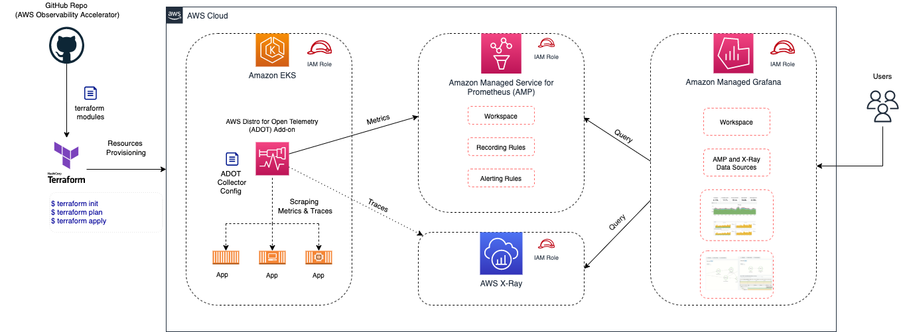

# AWS Observability Accelerator for Terraform

Welcome to the AWS Observability Accelerator for Terraform!

The AWS Observability accelerator is a set of Terraform modules to help you
configure Observability for your container workloads and environments with AWS
Observability services. This project proposes a core module to bootstrap
your Amazon EKS cluster with the AWS Distro for OpenTelemetry (ADOT) Operator for EKS,
Amazon Managed Service for Prometheus, Amazon Managed Grafana.

Additionally we have a set of workload modules to leverage curated ADOT
collector configurations, Grafana dashboards, Prometheus recording rules and alerts.

## Getting started

This project provides a set of Terraform modules to enable metrics and traces collection,
dashboards and alerts for monitoring:

- Amazon EKS clusters infrastructure
- NGINX workloads (running on Amazon EKS)
- Java/JMX workloads (running on Amazon EKS)
- Amazon Managed Service for Prometheus workspaces with Amazon CloudWatch

These modules can be directly configured in your existing Terraform configurations or ready
to be deployed in our packaged
[examples](https://github.com/aws-observability/terraform-aws-observability-accelerator/tree/main/examples)

!!! tip
    We have supporting examples for quick setup such as:

    - Creating an empty Amazon EKS cluster and a VPC
    - Creating and configure an Amazon Managed Grafana workspace with SSO (coming soon)

## Motivation

To gain deep visibility into your workloads and environments, AWS proposes a
set of secure, scalable, highly available, production-grade managed open
source services such as Amazon Managed Service for Prometheus, Amazon Managed
Grafana and Amazon OpenSearch.

AWS customers have asked for best-practices and guidance to collect metrics, logs
and traces from their containerized applications and microservices with ease of
deployment. Customers can use the AWS Observability Accelerator to configure their
metrics collection, leveraging [AWS Distro for OpenTelemetry](https://aws-otel.github.io/),
to have opinionated dashboards and alerts available in only minutes.

## Support & Feedback

AWS Observability Accelerator for Terraform is maintained by AWS Solution Architects.
It is not part of an AWS service and support is provided best-effort by the
AWS Observability Accelerator community.

To post feedback, submit feature ideas, or report bugs, please use the [issues](https://github.com/aws-observability/terraform-aws-observability-accelerator/issues) section of this GitHub repo.

If you are interested in contributing, see the [contribution guide](https://github.com/aws-observability/terraform-aws-observability-accelerator/blob/main/CONTRIBUTING.md).
